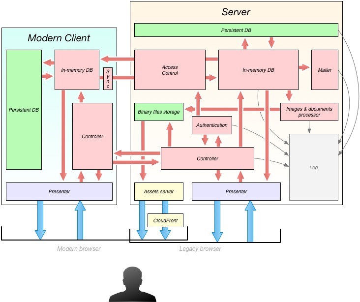

# eRegistrations Application Architecture

**eRegistrations** is full-stack JavaScript project, that means both **client** and **server** side logic is programmed in **JavaScript**.  

Below you can find diagram presenting bird's eye view of multilayerd architecture and bindings between all main components

---

---

Application server-side process runs on [Node.js](http://nodejs.org/) platform. It can be multiplied and load balanced among many different machines.

---
### Data tier

#### Server

##### Persistent DB

Persistently we save data in very low-level state, exactly just _key: value_ pairs. Any database engine (SQL and NoSQL) could be adapted to be used as physical storage.

For relational level handling of data like: joins, configuration of filters and other compositions, we use in-memory [DBJS](https://github.com/medikoo/dbjs#dbjs) engine. It allows us to compose and work with data in same language as we program application, it provides all means of access, that normally SQL databases provide, and it goes far beyond that.

Above setup with well thought configuration assures us with great scalability, we can easily load-balance traffic and data handling to many different servers, and maintenance is much easier as we use one programming language across all application runtimes.

##### Binary files storage

Dedicated folder within filesystem, can be hosted on different disk or different server.

#### Client (Modern Browser)
	
##### Persistent DB

[localStorage](http://dev.w3.org/html5/webstorage/#the-localstorage-attribute), simple key-value storage.

---
### Application tier

#### Server

Brain of application logic is [DBJS](https://github.com/medikoo/dbjs#dbjs) (in-memory, highly evented, database engine implemented in JavaScript). It imports what's needed from persistent layer and exposes natural for language data access interfaces.

_Authentication_ logic (backed with [bcrypt](https://github.com/ncb000gt/node.bcrypt.js) algorithm) is implemented within _mano-auth_ package. Results of authentication are decisive for _Access Control_ module which propagates database data via [Server Sent-Events](http://www.w3.org/TR/eventsource/) channel to modern clients.

All client submissions (data updates, authentication), both coming from modern and legacy browsers are validated and processed in _Controller_ layer.

Based on events that happen in database layer, configured email notifications are propagated with help of [Nodemailer](http://www.nodemailer.com/) module. Same way needed _Images and documents processing_ is triggered.

All internal events that are important to track source of eventual issues are saved in dedicated _log_ layer.

#### Client (Modern Browser)

Same as on server-side main component of application logic is [DBJS](https://github.com/medikoo/dbjs#dbjs) engine, it processes data applicable only for given client (which is securely chosen by _Access Control_ module on server-side). All updates made in client-side process are propagated back to server. Additional _Sync_ layer assures that updates eventually reach the server-side when they couldn't be delivered at time they happened.

All user submissions are validated and processed within _Controller_ layer and result either in direct database updates or are propagated for further processing to server-side.

---
### Presentation tier

#### Server

Generation of HTML documents via  _Presenter_ layer that is done on server, is configured only to provide fallback support to legacy engines and to generate PDF documents.
It's run with same presenter engine that is used directly within modern clients to create single page application experience.

Furthermore HTTP _Assets server_ serves all application static files. It can be additionally configured with _Amazon CloudFront_ (or similar) service to reduce latency and assure fast website access across the world.

#### Client (Modern Browser)

_Presenter_ layer assures routing for both GET and POST requests, builds requested views and assures fast single page application experience.

